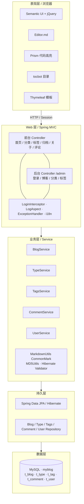

# MyBlog

个人博客系统，基于 Spring Boot 的前后端一体 Web 应用。支持前台浏览、搜索、分类 / 标签 / 归档展示，以及后台对博客、分类、标签的管理。

作者第一个练手项目。

## 功能概览

**前台**

- 首页：博客分页列表、热门分类 / 标签、推荐文章
- 博客详情：Markdown 转 HTML、目录、代码高亮、评论与回复
- 按分类、标签筛选文章
- 按年份归档
- 关键字搜索
- 关于我页面
- 中英文国际化（Thymeleaf + `messages*.properties`）

**后台**（`/admin`，登录后访问）

- 管理员登录 / 登出（Session + 拦截器）
- 博客新增、编辑、发布 / 草稿、删除、条件搜索
- 分类、标签的增删改查

## 技术栈

| 层级 | 技术 |
| --- | --- |
| 后端 | Spring Boot 2.3.1、Spring MVC、Spring Data JPA、Hibernate Validator |
| 模板 | Thymeleaf |
| 数据库 | MySQL |
| Markdown | CommonMark（表格、标题锚点） |
| 前端 | Semantic UI、jQuery、Editor.md、Prism、tocbot |
| 构建 | Maven、Java 8 |

## 技术架构

整体是经典的 **浏览器 → Spring MVC → Service → JPA → MySQL** 分层，前后台共用同一套业务与数据。



运行时由 **Spring Boot 2.3.1 + Java 8 + Maven** 组装：`dev` 默认 `8080`，`pro` 为 `8081`。

## 项目结构

```
src/main/java/com/ssz/blog/
├── BlogApplication.java          # 启动类
├── aspect/                       # AOP 请求日志
├── dao/                          # JPA Repository
├── hander/                       # 全局异常处理
├── interceptor/                  # 后台登录拦截
├── pojo/                         # 实体：Blog / Type / Tags / Comment / User
├── service/                      # 业务逻辑
├── util/                         # Markdown、MD5 等工具
├── vo/                           # 查询条件对象
└── web/                          # 前台 Controller
    └── admin/                    # 后台 Controller

src/main/resources/
├── application.yml               # 公共配置，默认激活 dev
├── application-dev.yml           # 开发环境（端口 8080）
├── application-pro.yml           # 生产环境（端口 8081）
├── i18n/                         # 国际化文案
├── static/                       # CSS / JS / 图片 / Editor.md
└── templates/                    # 前台与 admin 页面
```

数据表由 JPA 根据实体自动维护（开发环境 `ddl-auto: update`）：

| 实体 | 表名 | 说明 |
| --- | --- | --- |
| `Blog` | `t_blog` | 文章 |
| `Type` | `t_type` | 分类 |
| `Tags` | `t_tag` | 标签 |
| `Comment` | `t_comment` | 评论（支持父子回复） |
| `User` | `t_user` | 管理员 |

## 环境要求

- JDK 8+
- Maven 3.x
- MySQL 5.7 / 8.x

## 快速开始

1. 创建数据库：

```sql
CREATE DATABASE myblog DEFAULT CHARACTER SET utf8mb4;
```

2. 修改 `src/main/resources/application-dev.yml` 中的数据源账号密码（默认 `root` / `123456`）。

3. 启动应用：

```bash
mvn spring-boot:run
```

或在 IDE 中运行 `com.ssz.blog.BlogApplication`。

4. 访问：

- 前台首页：http://localhost:8080/
- 后台登录：http://localhost:8080/admin

开发环境首次启动会自动建表。后台登录前需在 `t_user` 中插入管理员账号，**密码存 MD5 值**（见 `MD5Utils`）。

切换生产配置：将 `application.yml` 中 `spring.profiles.active` 改为 `pro`（端口 `8081`，`ddl-auto: none`）。

## 主要页面

| 路径 | 说明 |
| --- | --- |
| `/` | 首页 |
| `/blog/{id}` | 博客详情 |
| `/search` | 搜索（POST） |
| `/types/{id}` | 分类（`id=-1` 为默认分类） |
| `/tags/{id}` | 标签 |
| `/archives` | 归档 |
| `/about` | 关于我 |
| `/admin` | 后台登录 |
| `/admin/blogs` | 博客管理 |
| `/admin/type` | 分类管理 |
| `/admin/tags` | 标签管理 |

## 配置说明

公共配置在 `application.yml`：

- 默认 Profile：`dev`
- 国际化资源：`i18n/messages`
- 游客评论头像：`comment.avatar=/images/p1.jpg`

开发 / 生产差异见 `application-dev.yml`、`application-pro.yml`（数据源、日志级别、端口、JPA `ddl-auto`）。

## 说明

- 后台接口除登录页外均需登录，由 `LoginInterceptor` 拦截 `/admin/**`。
- 博客正文以 Markdown 编写，详情页由 `MarkdownUtils` 转为 HTML。
- 请求日志由 `LogAspect` 记录前台 Controller 的 URL、IP 与方法。
- 未捕获异常由 `ControllerExceptionHandler` 转到 `error/error` 页面。
